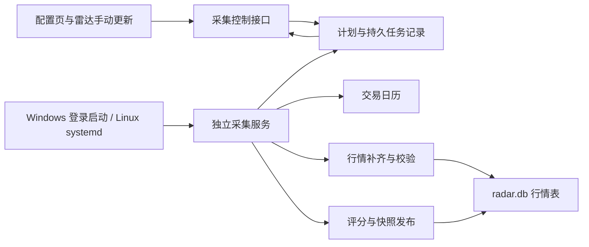

# 配置雷达自动采集重构设计

日期：2026-09-30

状态：业务规则已确认；界面为待确认预览，本文作为实施基线。

## 已确认规则

1. Windows 本地使用与 Linux 长期部署同等重要。
2. Windows 用户登录后启动，无需支持未登录时采集。
3. 独立采集服务不依赖浏览器和网页服务的生命周期。
4. 自动采集开关与系统启动设置分开；关闭自动采集后服务待命，手动采集可用。
5. 默认北京时间 18:30，可修改，按交易日历跳过休市日。
6. 每次执行读取所有已启用的标的池；新增池默认加入，停用池退出。
7. 恢复运行时更新到最近已结束交易日，补齐底层行情，不逐日生成遗漏快照。
8. 已完成的目标日期跳过；部分失败重试失败项；手动与自动共用执行流程。
9. 原位扩展现有数据和状态，不使用 `_v2` 名称，不清空已有快照。

## 源码事实与缺口

- `collector.py` 在独立进程内调度；默认周一至周五运行，不认识节假日。
- `collector_autostart.py` 只实现 Windows 启动管理；启动文件夹分支没有立即拉起进程。
- `radar_collector.db` 保存最近结果、历史心跳和事件，缺乏持久任务队列及实时阶段。
- `api/radar.py` 的手动刷新使用进程内线程和字典，无法与独立采集进程统一互斥。
- `RadarUniverse` 没有池级 `enabled`；`load_all()` 返回版本列表，不能直接当成执行池列表。
- `RadarRefresher.refresh()` 默认请求 500 个自然日，`full` 请求 2000 日；它们均非完整历史承诺。
- `LocalETFDataProvider` 读取用户导入 CSV，不能把命中部分区间当成已补齐目标行情。
- `project_state_dir()` 取当前工作目录；系统启动适配必须固定项目目录，避免状态落到别处。

## 架构与职责

- 服务启动与任务开关分离：服务常驻，读取数据库设置，自动开关只影响自动任务的生成与继续执行。
- 网页接口写计划、创建任务、读取状态；长耗时采集由独立服务执行。
- 应用拥有计划和补采规则；系统启动器只管理进程，不再硬编码业务执行时间。
- 自动日程采用显式 `Asia/Shanghai` 时区；恢复、设置变化和到点都进入同一个协调入口。
- 默认以 5 秒轮询协调任务，心跳每 15 秒一次；超过 60 秒未更新显示服务离线。这些为实施默认值，不新增首页控件。

## 交易日与目标日期

- 当前池中的海外敞口 ETF 仍是境内上市 ETF，按上市交易所日历判断，不按敞口所在国家日历判断。
- 从 AkShare 交易日历适配器获取日期表，落地缓存；必须记录覆盖范围和更新时间。
- 缓存可覆盖目标日期时继续使用；覆盖不足且网络失败时显示“交易日历不可用”，不退回周一至周五推断。
- 目标为日历中最近一个已结束交易日。盘中恢复服务时使用上一个已结束交易日；收盘后的数据尚未就绪时等待重试。
- 定时入口在交易日 18:30 触发。休市日不生成定时任务，但服务恢复时可以补齐此前遗漏的最新目标日期。
- 手动立即采集采用同样的目标日期；历史指定日期保留在 CLI，用显式参数处理。

## 动态标的池

- 给 `RadarUniverse` 增加 `enabled: bool = True`，旧 YAML 保持可读。
- 按池 ID 去重，再按目标日期选唯一生效版本，并过滤标的有效期。
- 同一目标日期出现多个生效版本时显式报配置错误，不任意选最新。
- 尚无对应数据适配器的资产类型显示不支持原因，不静默跳过或伪装成功。
- 队列创建时记录池版本、有效标的和评分规则指纹；执行前复核当前启用状态。
- 新增或更改标的/规则导致指纹改变时，允许对同一天重新生成快照；仅同日期同指纹的完整成功任务跳过。

## 行情补齐与快照

- 在 `radar.db` 原位新增行情与覆盖表。唯一键包含市场、标的、价格口径、来源系列及日期；禁止不同复权口径混合。
- 首次无缓存时至少建立评分所需窗口；已有历史从已声明覆盖起点补齐缺口并延伸至目标日。历史表现/回测需要更早区间时复用同一补齐服务扩展覆盖。
- 数据源实际可提供的起点需记录，不把请求的起点标为已覆盖，也不把 2000 日称为成立以来。
- 拉取重叠窗口以接收上游修订；复权基准变化时失效并重建对应历史，不能只追加最新行。
- 校验排序、日期去重、OHLC/成交字段、未来日期和目标日新鲜度；上市前、停牌或确无交易需要可核验状态，不把空行当成网络成功。
- 用户 CSV 保留为单独来源；只有覆盖与口径符合请求时才可作为本次数据。导入数据不被自动覆盖。
- 每个池在目标日发布一个完整产物，记录成功、失败、沿用旧数据的项；全失败不替换旧健康快照。
- 部分失败重试时复用已成功行情，只补失败标的；完成后以完整池成员重算横截面评分和排名，发布新的不可变快照并注明替代关系。
- 不为遗漏的每个历史日期生成雷达快照。

## 任务与防重复执行

- 扩展 `radar_collector.db`：`collector_settings`、`collector_runs`、`collector_run_items`、`collector_runtime` 和事件记录。
- 配置保存使用事务和修订号，前端冲突时刷新后重试，避免网页与进程修改互相覆盖。
- 服务进程使用项目目录内 `FileLock` 保证单实例；执行器另有共享执行锁，串行处理池任务，降低数据源压力。
- SQLite 原子认领任务，关联 worker 实例 ID、租约及心跳。进程崩溃后回收失效任务，保留中断事件和已成功数据。
- 自动、手动和恢复任务共享日期/池/规则指纹去重；重复点击返回已有任务 ID。
- 状态：排队、补齐行情、计算评分、发布快照、完成、部分失败、失败、已取消、已中断。
- 默认总共 3 次尝试，失败后约 1 分钟、5 分钟重试，仅重试可恢复的数据源错误；配置错误直接停止该池。
- 同一目标与指纹达到重试上限后保持终态，周期协调不得重新创建无限重试任务；手动重试或下一目标日期才允许新尝试。
- 关闭自动采集取消尚未开始的自动任务及自动重试。正在执行的自动任务在数据请求超时或标的边界停止，记录取消；手动任务继续。
- 数据源请求必须有超时。不能宣称关闭开关能立即终止正在阻塞的第三方调用。

## 平台启动适配

### Windows

- 使用当前用户的登录触发任务，固定工作目录和当前环境 Python 的绝对路径。
- 任务名包含项目路径短指纹，避免多个项目相互覆盖；设置单实例、失败重启、常驻无运行时限、不因电池或空闲条件意外停止。
- 注册后显式启动并等待新鲜心跳，不能仅创建文件就显示服务在线。
- 无权限时保留明确原因，可手动启动；启动文件夹只作为可说明的降级方式，不能宣称具备同等崩溃恢复能力。
- 自动采集开关不再删除启动任务。取消登录启动只更改启动方式，不关闭当前服务。

### Linux

- 提供 systemd 系统服务模板，设置固定 `WorkingDirectory`、虚拟环境 Python、普通服务账户和 `Restart=on-failure`。
- 首次安装/启用由部署命令完成；网页不执行 sudo、不替用户提权。
- 网页显示实际系统启动状态；无法变更系统设置时给出部署说明，业务采集开关始终独立可用。
- 不具备 systemd 的环境可用前台守护命令，由容器或外部服务管理器托管；页面明确显示“手动托管”。
- Linux 真实登录断开、服务崩溃、重启和状态目录验收必须在 Linux 主机完成，平台模拟测试不算通过。

依据：[Microsoft 登录触发器文档](https://learn.microsoft.com/en-us/windows/win32/taskschd/logontrigger)、[systemd 服务文档源码](https://github.com/systemd/systemd/blob/main/man/systemd.service.xml)。具体平台命令在实现前做无副作用探针，注册与重启在验收阶段执行。

## 页面与接口

配置页现有自动采集区域改成一张卡片：

- 标题“配置雷达自动采集”、设置小按钮。
- 自动采集开关及计划摘要“交易日 18:30（北京时间）”；范围摘要“全部已启用标的池 · N 个”。
- 服务状态独立展示“在线 · 等待执行”“采集中”或“离线”，自动关闭时显示“自动采集已关闭 · 可手动采集”。
- 最近结果一行；下一次计划一行，离线时注明“计划时间，服务恢复后执行”。
- “立即采集”“查看记录”小按钮；离线时立即采集给出启动入口，不能无限排队。

设置弹窗包含时间、范围说明、恢复规则说明与平台启动设置。记录弹窗展示目标日、来源、状态、耗时、池级结果及失败原因；重试按钮只在可重试记录出现。

界面复用当前 CSS 变量、`panel`、`settings-section`、按钮和共享页面坐标。预览为交互原型，示例数据不连接真实采集接口。

接口建议：

| 方法与路径 | 用途 |
|---|---|
| GET/PUT `/api/v1/radar/collector/config` | 计划、启用状态与修订号 |
| GET `/api/v1/radar/collector/status` | 服务健康、阶段、范围、最近结果、下一计划 |
| POST `/api/v1/radar/collector/runs` | 手动任务，返回 202 与任务 ID |
| GET `/api/v1/radar/collector/runs`、`/{id}` | 执行记录与池/标的级详情 |
| POST `/api/v1/radar/collector/runs/{id}/retry` | 幂等重试失败项 |
| GET `/api/v1/radar/collector/startup` | 平台启动能力与真实状态 |
| PUT `/api/v1/radar/collector/startup` | 有权限的本机启动配置；与业务开关分离 |

原有 `/refresh` 改为统一任务入口，原任务状态路径用持久记录兼容过渡，前端迁移后删除进程内字典实现。Windows 启动变更保持本机限制；Linux 远程页面只读系统启动状态，通过原业务配置接口调整采集计划。

## 迁移与验收

- 不删除 `radar.db`、旧采集审计、用户行情和历史快照。
- 初始化新设置时读取旧关闭标记，标记存在则保持关闭；缺标记且旧启动状态不明确时保持关闭并显示迁移提示。
- 原旧进程无新锁，切换前必须按本项目命令行及工作目录识别并停止它，之后启用新启动项；不按进程名批量结束。
- 旧启动项清理失败时显示待清理原因，先维持关闭标记，避免旧进程与新服务竞争。迁移完成才处理标记，不使关闭状态丢失。
- 验收覆盖日历休市与覆盖不足、睡眠恢复、停机补采、成功跳过、池变更、部分失败、重复触发、双进程、执行中关闭和崩溃恢复。
- 两个平台均验证关闭浏览器、网页服务重启不打断采集。Windows 验证登录启动；Linux 验证 systemd 重启恢复。
- 实现前仍需实测：日历接口年份覆盖、各数据源历史与复权口径、Windows 当前用户任务权限、Linux 服务运行账户与写权限。
